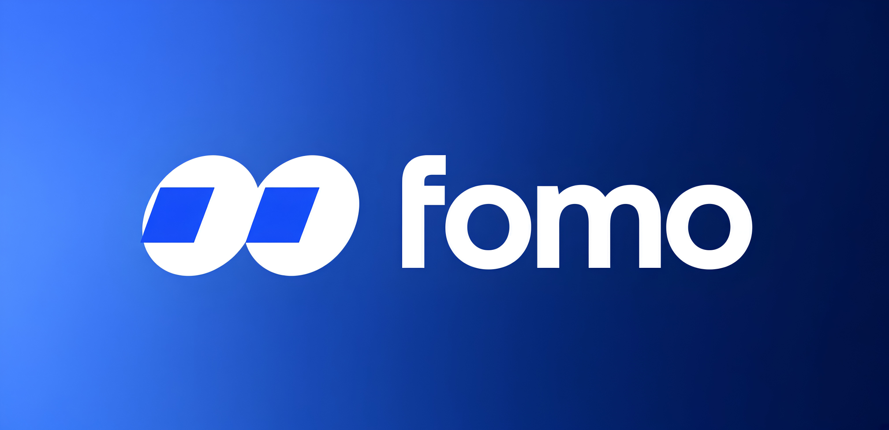

# ⚡ FOMO Desktop App

> **Next-Generation Multi-Chain Trading Terminal for Power Traders.**
> Trade Solana, Base, BNB Chain, and Ethereum tokens at lightspeed with zero-latency execution, native OS security, and institutional-grade charting.

[](../../releases)
[](https://github.com/fomo-app/fomo-desktop)

[](LICENSE)
[](/security)

<div align="center">
  <a href="../../releases/latest">
    
  </a>
</div>

---

## ⚡ Why Desktop? (FOMO Web vs FOMO Desktop)

While the **FOMO Web** application provides convenience for quick browser trading, **FOMO Desktop** is engineered from the ground up for high-frequency traders, snipers, and active Web3 participants who require sub-millisecond execution, uncompromising security, and advanced multi-monitor workflows.

| Feature / Metric | 🌐 FOMO Web App | ⚡ FOMO Desktop Client |
| :--- | :--- | :--- |
| **Execution Speed & Updates** | Throttled by browser event loops (150–300ms) | **Direct Rust/IPC node connection (<15ms latency)** |
| **Key & Credential Storage** | Browser LocalStorage / Extension memory | **Hardware OS Enclave (macOS Keychain / Windows Vault)** |
| **RPC & Node Routing** | Shared public endpoints with rate limits | **Dedicated Custom RPCs + Automatic Node Failover** |
| **Multitasking & UI** | Fixed single tab, background tab throttling | **Floating Picture-in-Picture (PiP) Overlay Mode** |
| **Charting Engine** | Standard embedded TradingView frame | **Native TradingView SDK with 4x4 Grid Multi-Chart** |
| **Alerts & Push Notifications** | Web Push (frequently delayed or blocked) | **Native System-Tray & Low-Latency OS Notifications** |
| **Hotkeys & Execution** | Tab-focused basic shortcuts | **Global System-Wide Hotkeys & Instant One-Click Snipe** |

### 🚀 Core Advantages of Desktop Engine:

* ⚡ **Native Speed & Zero-Lag Orderbook:** Bypasses web browser process isolation and JavaScript garbage collection overhead using lightweight native Rust bindings. Direct IPC socket connections to custom RPCs ensure sub-millisecond orderbook updates and instant execution.
* 🔒 **Hardware-Grade Enclave Security:** Your private keys, seed phrases, and API tokens are encrypted natively within your operating system's Secure Enclave (macOS Keychain, Windows Credential Manager, Linux Secret Service). Zero exposure to browser extension exploits or malicious web injection scripts.
* 📺 **Picture-in-Picture (PiP) Overlay Mode:** Track volatile meme coins, live PnL, and whale buys in a pinned, fully customizable mini-terminal that floats above all other applications, coding environments, or spreadsheets.
* 📊 **Institutional TradingView SDK Integration:** Enjoy responsive multi-chart layouts (up to 16 synchronized charts simultaneously), custom indicators, visual order placing directly on charts, and real-time orderflow heatmaps.
* 🌐 **Multi-Chain Node Failover Engine:** Configure private RPC endpoints (Helius, QuickNode, Alchemy) with intelligent automated failover — if one endpoint encounters rate limits during a hyped launch, your transaction seamlessly routes through backup nodes instantly.

---

## ✨ Key Features

* **🚀 Meme Coin & Token Sniping:** Instant liquidity detection on Solana (Pump.fun, Raydium, Meteora), Base (Aerodrome, Uniswap), and BNB Chain.
* **🛡️ Real-Time Security & Rug-Pull Protection:** Automated token analysis evaluating LP lock duration, top 10 holder concentration, mint authority, and honey-pot flags before every execution.
* **👥 Whale Tracking & Smart Money Copy-Trading:** Real-time notifications and automated copy-trading mirrored from high-PnL wallets.
* **⌨️ Global Custom Keybindings:** Trigger instant buy/sell orders, alter slippage settings, or execute emergency position wipes using global keyboard shortcuts.
* **💰 Gasless Unified Wallet:** Trade across multiple chains with a single balance without holding native network gas tokens on every target chain.

---

## 📥 Download & Installation

Download the latest verified build for your operating system from the [**Releases Page**](../../releases).

### 🪟 Windows Setup (.exe)
1. Download `FOMO-app-x64.7z` from the latest release.
2. Run the executable setup wizard.
3. *Note (SmartScreen Warning):* If Windows SmartScreen prompts on unsigned preview binaries, click **More Info** -> **Run Anyway**.
4. Launch **FOMO Desktop** from your Desktop or Start Menu.

### 🍎 macOS Setup (.dmg)
* **Apple Silicon (M1/M2/M3/M4):** Download `FOMO-app.dmg`

**Steps:**
1. Open the downloaded `.dmg` image file.
2. Drag and drop the **FOMO** app icon into your `/Applications` directory.
3. Launch FOMO from Launchpad.
4. *macOS Gatekeeper Note:* If prompted with an unverified developer warning, run the following terminal command once:
   ```bash
   xattr -d com.apple.quarantine /Applications/FOMO.app
   ```
   
## ⚙️ Configuration & Customization

You can customize RPC endpoints, latency parameters, and UI themes inside `Settings` -> `Advanced Engine` or by editing `~/.fomo/config.json`:

```json
{
  "rpcEndpoints": {
    "solana": "[https://mainnet.helius-rpc.com/?api-key=YOUR_KEY](https://mainnet.helius-rpc.com/?api-key=YOUR_KEY)",
    "base": "[https://mainnet.base.org](https://mainnet.base.org)",
    "failoverTimeoutMs": 150
  },
  "security": {
    "hardwareVault": true,
    "autoBlockHoneypot": true,
    "maxSlippageBps": 100
  },
  "ui": {
    "alwaysOnTop": true,
    "pipModeWidth": 380,
    "pipModeHeight": 600
  }
}

```

---

## 🔒 Security & Privacy

* **Zero Plaintext Storage:** Private keys and seed phrases are never written to disk in plain text.
* **Isolated IPC Architecture:** Frontend Webview and Rust core communicate over restricted, strongly-typed IPC bridges.
* **Zero Remote Execution:** Dynamic `eval()` calls and remote dynamic scripts are strictly disabled.

---

## ⚠️ Risk Disclaimer

*FOMO Desktop is open-source software provided "as is" without warranty. Cryptocurrency and token trading involve high financial risk. Always verify smart contract addresses independently before executing transactions.*

---

## 📜 License

Distributed under the **MIT License**. See [`LICENSE`](LICENSE) for full details.
